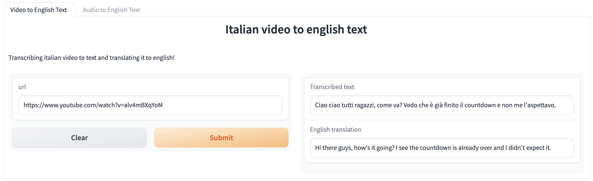

# Lab 2 for ID2223 Course @ KTH

**Keywords:** scalable machine learning, data engineering, classification, model ensemble
<p align="center">
    
</p>

## Team

**Name:** GoodOnions\
**Components:** [Daniele Cipollone](https://github.com/dancip00), [Federico Bono](https://github.com/FredBonux)

## Project description
The project is based on fine-tuning the [Wisper model](https://huggingface.co/openai/whisper-small), specializing it in one's native language. In our case, we used Italian.

To achieve this, we employed the reduced version of Wisper, namely Wisper-small, allowing reasonable fine-tuning times even on less powerful graphics cards, with this reduced model having 244 million parameters. For fine-tuning, we utilized a portion of the  [Common voice](https://huggingface.co/datasets/mozilla-foundation/common_voice_11_0/viewer/sv-SE/train) dataset.

Specifically, we used:
- 10,000 examples for training
- 2,500 examples for testing
The fine-tuning process was carried out using the Hugging Face library. In particular, we utilized the Trainer class, which allows for a simple and fast fine-tuning process.

Image of wisper model architecture:
<p align="center">
    

## Repository structure
```
├── README.md
├── 01-Data-Preparation.ipynb
├── 02-Model-Fine-Tuning.ipynb
```
We have splitted the data pipeline in two notebooks, one for data preparation and one for model fine-tuning. The first notebook is used to download the dataset and prepare it for fine-tuning. The second notebook is used to fine-tune the model and evaluate it on the test set.

In this way is possible to run the data processing on CPU and the model fine-tuning on GPU. Features are saved in google drive.
## Hagging Face interface
After the training phase, we uploaded the model to the [Hugging Face](https://huggingface.co/) platform, which allows us to use the model through a simple REST API. The model can be found at the following [link](https://huggingface.co/FredBonux/whisper-small-it).

The model can be used in two different ways:
- **Audio to text** : the model takes as input an audio file and returns the corresponding italian text, then the text is translated into english.
- **Video to english text** : the model takes as input a video file and returns the corresponding english text.



Open the interface [here]((https://huggingface.co/spaces/GoodOnions/ID2223-Lab2))!

## Task 2: Improve model performance 
In order to improve performance we can use 2 different approaches:
- **Data-centric approach**: focus on improving the quality of the data used for training. This can be done by increasing the amount of data used for training, or by improving the quality of the data used for training.
- **Model-centric approach**: focus on improving the model architecture. This can be done by increasing the number of parameters of the model, or by improving the model architecture.

